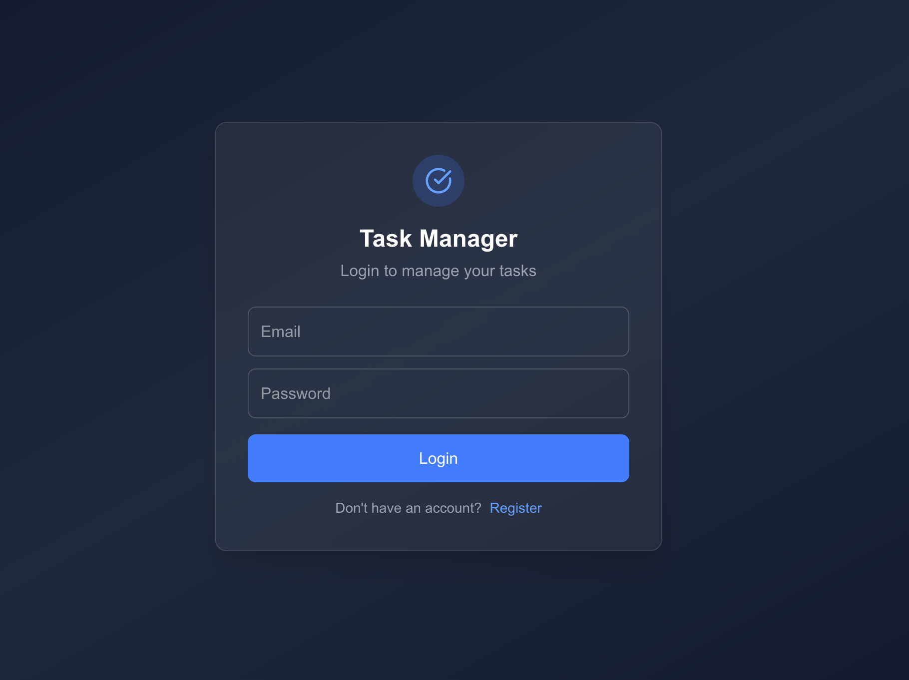
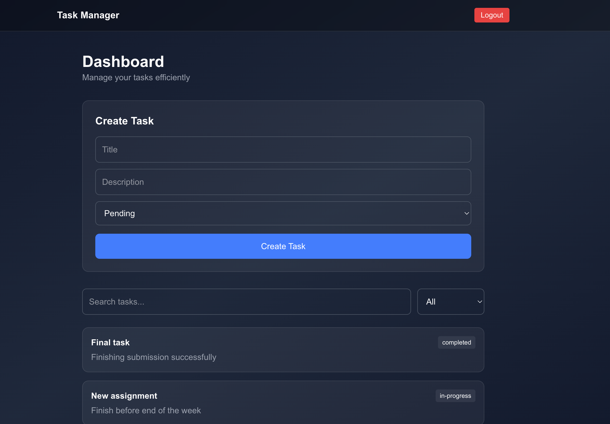

# Secure Task Manager (Full Stack)

A full-stack task management application with **end-to-end encrypted API communication**, built using **Next.js, Node.js, Express, and MongoDB**.

Live Demo
Frontend: https://task-engine-delta.vercel.app
Backend API: https://task-engine.onrender.com

---

## Features

* User authentication with JWT
* Secure cookies for session management
* End-to-end AES encrypted API payloads
* Task creation and management
* Search and status filtering
* Pagination support
* Responsive modern UI
* Fully deployed cloud architecture

---

## Tech Stack

Frontend

* Next.js (App Router)
* TailwindCSS
* Axios

Backend

* Node.js
* Express.js
* JWT Authentication

Database

* MongoDB Atlas

Deployment

* Vercel (Frontend)
* Render (Backend)

Security

* AES Encryption (CryptoJS)
* HTTP-only cookies
* CORS protection

---

## Architecture

           ┌──────────────────────┐
           │  Next.js Frontend    │
           │  (Vercel Deployment) │
           └─────────┬────────────┘
                     │
                     │ AES Encrypted API Requests
                     │
           ┌─────────▼────────────┐
           │  Express Backend     │
           │  (Render Deployment) │
           │  JWT Authentication  │
           └─────────┬────────────┘
                     │
                     │
             ┌───────▼────────┐
             │   MongoDB      │
             │   Atlas DB     │
             └────────────────┘

The frontend encrypts request payloads before sending them to the backend.
The backend decrypts incoming data, processes the request, and returns encrypted responses.
---

## Screenshots

### Authentication Page



### Dashboard & Task Management



---

## Running Locally

Backend

```bash
cd backend
npm install
npm run dev
```

Frontend

```bash
cd frontend
npm install
npm run dev
```

---

## Environment Variables

Create a `.env` file in the backend folder:

```
PORT=5001
MONGO_URI=your_mongo_uri
JWT_SECRET=your_secret
AES_SECRET=your_secret
```

---

## Author

Siddhant Chasta
IIT Kharagpur

---
